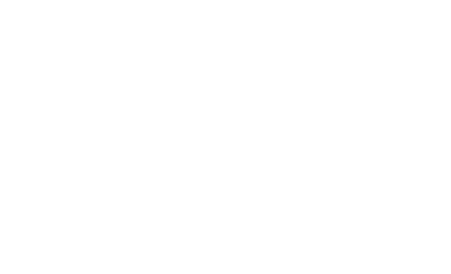

#  Hola Soy Daniel Pulido 

👨‍💻 **Tecnólogo en Gestión de Redes de Datos** | **Entusiasta de la Ciberseguridad** | **Apasionado por las Telecomunicaciones**

Actualmente estoy realizando mi etapa práctica en **IPS Previred**, donde soy responsable de gestionar y mantener la red de telecomunicaciones. Mi enfoque principal está en la ciberseguridad, el hacking ético, y la automatización de procesos.

## 🚀 Habilidades

- **Redes de Datos**: Diseño, implementación y mantenimiento de redes de datos.
- **Ciberseguridad**: Configuración y análisis de seguridad en redes y sistemas.
- **Programación**: Scripts de automatización y análisis en Bash, Python.
- **Virtualización**: Experiencia con Hyper-V, VirtualBox, y entornos de laboratorio.

## 🌱 Actualmente

- Mejorando mis habilidades en **Pentesting** y **Redes Defensivas**.
- Explorando nuevas tecnologías en **Cloud Computing**.

## 🛠️ Herramientas

- **Sistema Operativo**: Linux (Ubuntu, Kali), Windows Server
- **Networking**: Cisco Packet Tracer, Wireshark
- **Desarrollo**: Visual Studio Code, Git
- **Automatización**: Bash, Python

## 📫 Cómo contactarme

---

⚡ **Siempre en busca de nuevos retos y aprendizajes en el mundo de las telecomunicaciones y la ciberseguridad.**
